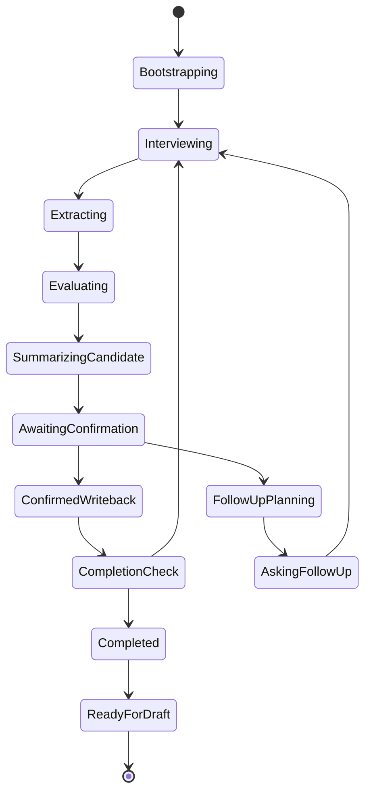
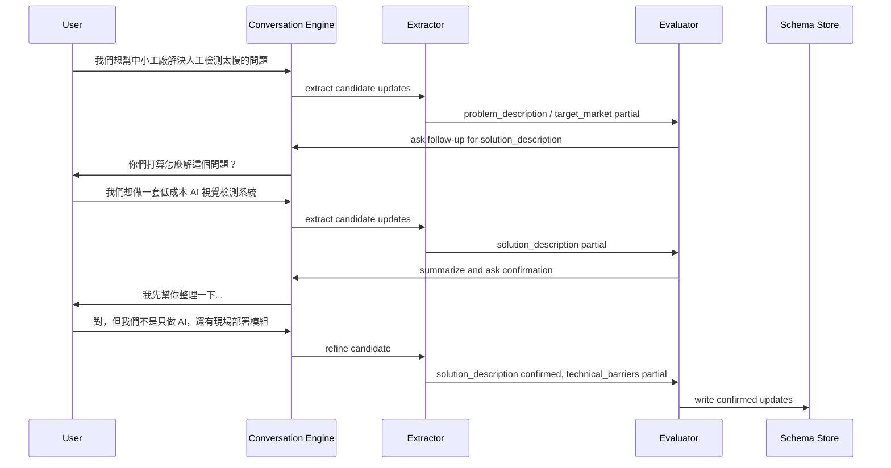

# 專案資料對話狀態機設計

## 文件目的

這份文件定義「專案資料」在未來顧問式對話模式下的狀態機與流程控制方式。

目標不是做聊天介面，而是做一個能夠：

1. 自然訪談
2. 抽取 29 題資訊
3. 判斷缺漏
4. 主動追問
5. 候選回述確認
6. 在 29 題全部完成前不允許草稿生成

## 基本原則

1. 對話是 UX
2. 29 題 schema 是 engine
3. 每一輪對話都要回寫 schema 狀態
4. 對話不是無限自由，而是以 completion 為目標的 guided interview

## 狀態機總覽



## 核心狀態說明

### 1. `Bootstrapping`

用途：

1. 載入既有專案資料
2. 載入 29 題狀態
3. 決定起始訪談段落
4. 決定是新專案還是續訪談

輸入：

1. `project_id`
2. `existing_answers`
3. `question_status_map`
4. `interaction_mode`

輸出：

1. `current_interview_stage`
2. `next_prompt_strategy`
3. `missing_priority_queue`

### 2. `Interviewing`

用途：

1. 接收使用者自然語言或語音轉錄輸入
2. 不要求一題一答
3. 接住發散內容

輸入：

1. `user_utterance`
2. `conversation_history`
3. `active_target_questions`

輸出：

1. `turn_record`
2. `raw_utterance_blob`

### 3. `Extracting`

用途：

1. 把這輪對話抽成結構化欄位候選
2. 一次可對應多題
3. 每一題帶信心值與證據

輸出資料結構建議：

```json
{
  "candidate_updates": [
    {
      "question_id": "problem_description",
      "candidate_answer": "中小型工廠缺乏即時生產數據...",
      "confidence": 0.86,
      "evidence_turn_ids": ["turn_12", "turn_13"],
      "reason": "User explicitly described current pain and consequences"
    }
  ]
}
```

### 4. `Evaluating`

用途：

1. 判斷 candidate answer 對每一題是：
   - `missing`
   - `partial`
   - `confirmed`
2. 判斷哪些題需要追問
3. 判斷目前該優先追哪一題

輸入：

1. `candidate_updates`
2. `current_question_statuses`
3. `question_specs`

輸出：

1. `promotable_confirmations`
2. `partial_questions`
3. `follow_up_targets`

### 5. `SummarizingCandidate`

用途：

AI 不直接把 candidate 寫死，而是先生成「顧問回述版」。

例如：

「我先幫你整理一下：你們現在想解的是中小工廠缺乏即時數據導致良率低與成本高，打算用低成本 AI 視覺檢測系統來處理。這樣理解對嗎？」

這一步是本產品的核心，不是直接問下一題。

### 6. `AwaitingConfirmation`

用途：

等待使用者：

1. 確認
2. 修正
3. 補充

允許使用者操作：

1. `confirm`
2. `edit`
3. `append`
4. `reject_and_rephrase`

### 7. `ConfirmedWriteback`

用途：

1. 把已確認答案正式寫回 canonical schema
2. 更新：
   - `normalized_answer`
   - `question_status`
   - `confidence`
   - `evidence`
   - `confirmed_at`

### 8. `FollowUpPlanning`

用途：

1. 根據當前缺漏，決定下一個最值得追問的問題
2. 追問不是照固定順序，而是看：
   - 優先級
   - 依賴關係
   - 使用者剛剛談到的脈絡

排序因子建議：

1. `is_required = true`
2. `is_in_current_stage = true`
3. `dependency_satisfied = true`
4. `semantic_proximity_to_recent_turn = high`

### 9. `AskingFollowUp`

用途：

產生自然追問，而不是顯示生硬欄位問題。

例如：

1. 「你剛剛提到傳統方案太貴，那你們現在的做法成本大概能壓低多少？」
2. 「我理解你們技術不只是 AI，而是整個現場部署方式比較不同，這一塊你再多說一點。」

### 10. `CompletionCheck`

用途：

每一輪都要判斷：

1. 29 題是否全部 `confirmed`
2. 若否，哪些題還缺
3. 下一步是繼續訪談還是完成

### 11. `Completed`

條件：

1. 29 題全部 `confirmed`

輸出：

1. `project_data_completion = 100%`
2. `draft_generation_allowed = true`

### 12. `ReadyForDraft`

用途：

1. 對專案資料鎖定版本
2. 允許後續草稿生成

## 對話流程範例



## 模式切換：打字版與語音版共用狀態機

兩種模式的差別只在 input layer，不在 interview engine。

### 打字版

輸入：

1. 文字輸入框
2. 使用者手動補述

### 語音版

輸入：

1. 即時轉錄文字
2. 語音回合切分後的 transcript

兩者都進：

1. `Interviewing`
2. `Extracting`
3. `Evaluating`
4. `AwaitingConfirmation`

## 狀態轉移條件

### `Interviewing -> Extracting`

條件：

1. 使用者一輪輸入結束
2. transcript 完成

### `Extracting -> Evaluating`

條件：

1. 至少有一筆 candidate update
2. 或判斷完全沒有可抽取內容

### `Evaluating -> SummarizingCandidate`

條件：

1. 至少有一筆候選答案值得回述確認

### `Evaluating -> FollowUpPlanning`

條件：

1. 只有 partial / missing
2. 沒有足夠 candidate 可確認

### `CompletionCheck -> Completed`

條件：

1. 所有 29 題狀態為 `confirmed`

## 追問策略

### 優先追問類型

1. 目前 stage 的核心題
2. 剛剛對話已觸及但不足的題
3. 高依賴題

### 不要追問的情境

1. 使用者剛給了大量新資訊，需要先整理
2. 同一題已連續追問 2 次以上仍無法收斂
3. 目前缺的是數字，但核心論述尚未穩定

## 錯誤處理

### 模型抽取不一致

處理：

1. 不直接寫入 confirmed
2. 轉成回述確認

### 使用者回覆發散過長

處理：

1. 先摘要
2. 再分主題
3. 再逐一確認

### 使用者拒答某題

處理：

1. 允許先略過
2. 保持 `missing`
3. 但草稿前仍必須回補

## 與現有系統的接口需求

至少要新增：

1. `conversation_sessions`
2. `conversation_turns`
3. `question_statuses`
4. `candidate_answer_confirmations`

## 主要外部依據

1. OpenAI Realtime Guide  
   https://platform.openai.com/docs/guides/realtime
2. OpenAI Voice Agents Guide  
   https://platform.openai.com/docs/guides/voice-agents
3. OpenAI Audio Guide  
   https://platform.openai.com/docs/guides/audio
4. OpenAI Tools / Function Calling  
   https://platform.openai.com/docs/guides/tools?api-mode=responses
